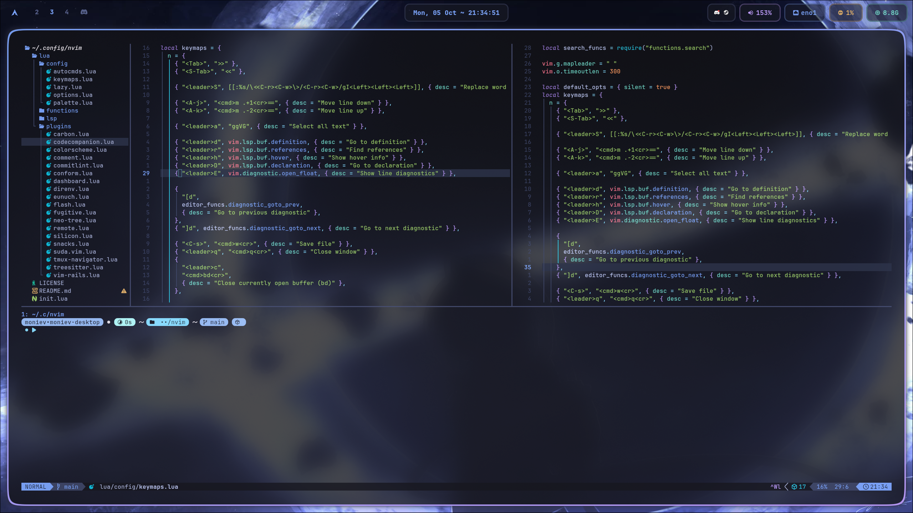

# 💤 lazy-vim-configs

**lazy-vim-configs** is a personal Neovim configuration built on top of [LazyVim](https://www.lazyvim.org/), extended with a custom AI engine, multi-language LSP setup, and a hand-rolled plugin/function layer in Lua.

## Preview



## Key Features

* **Embedded AI Engine:** Ships a prebuilt [`nvim-ai-engine`](bin/nvim-ai-engine) binary (built from [nvim-engine](https://github.com/robertmon-dev/nvim-engine)), launched over MessagePack-RPC (`lua/functions/ai/bridge.lua`) for non-blocking LLM requests.
* **AI-Assisted Git Commits:** `lua/functions/git/git_ai_commit.lua` sends the staged diff to the AI engine (or CodeCompanion) to generate a Conventional Commits-compliant message.
* **AI Chat & Agent:** [codecompanion.nvim](https://github.com/olimorris/codecompanion.nvim) wired to the Anthropic adapter for chat, inline, and agent strategies (`lua/plugins/codecompanion.lua`, `lua/functions/codecompanion_actions.lua`).
* **Multi-Language LSP:** Per-language setup under `lua/lsp/` for C/C++ (clangd), Go, Java, Lua, Markdown, Python, Ruby, Rust, and TypeScript.
* **LazyVim Extras:** TypeScript, Go, Java, Python, Ruby, SQL, Tailwind, YAML/TOML/JSON, Markdown, Prettier formatting, and VS Code keybinding compatibility (`lazyvim.json`).
* **Custom Functions:** Dashboard, logger, search, window/pin dialogs, Rust actions, and Git helpers (`lua/functions/`).
* **Curated Plugins:** Flash motion, Neo-tree, Fugitive, tmux-navigator, Conform formatting, Commitlint, Carbon, direnv, and a custom colorscheme/palette (`lua/plugins/`).

## Installation

### Requirements
* [Neovim](https://neovim.io/) (0.9+)
* `git`, a [Nerd Font](https://www.nerdfonts.com/) for icons
* API key(s) for the AI engine (Anthropic, and/or OpenAI/Gemini) if you want AI features

### Build and Installation

```bash
git clone https://github.com/Moniev/lazy-vim-configs.git ~/.config/nvim

nvim
```

On first launch, `init.lua` bootstraps [lazy.nvim](https://github.com/folke/lazy.nvim) and installs all plugins automatically.

The `nvim-ai-engine` binary under `bin/` is prebuilt; to rebuild it from source, see the [nvim-engine](https://github.com/robertmon-dev/nvim-engine) repo's own `make install`.

## Configuration

### Environment Variables
The AI engine reads provider API keys from the environment (set in your `.zshrc`/`.bashrc`/`config.fish`, or override the binary path):

```bash
export ANTHROPIC_API_KEYS="<pass your keys>"
export OPENAI_API_KEYS="<pass your keys>"
export GEMINI_API_KEYS="<pass your keys>"
```

To point at a different engine binary, set in `init.lua` or a local override:

```lua
vim.g.ai_engine_bin_path = "/path/to/nvim-ai-engine"
```

## Project Structure

```text
├── init.lua                  # bootstraps lazy.nvim, loads config.lazy
├── lazyvim.json               # enabled LazyVim extras
├── bin/
│   └── nvim-ai-engine          # prebuilt AI engine binary (RPC server)
└── lua/
    ├── config/                 # options, keymaps, autocmds, lazy.nvim setup, palette
    ├── functions/
    │   ├── ai/                  # bridge.lua (RPC client), prompts.lua
    │   ├── git/                  # git.lua, git_ai_commit.lua
    │   └── windows/                # dialog.lua, pin.lua
    ├── lsp/                       # per-language LSP configs
    └── plugins/                    # plugin specs (codecompanion, flash, fugitive, ...)
```

## Development and Testing

* **Check plugin/LSP health:** `:Lazy` and `:checkhealth` inside Neovim
* **Inspect AI engine logs:** `:Tele` helpers in `lua/functions/logger.lua`, or the engine's own log file (see `nvim-engine`'s README, `/tmp/nvim-engine.log`)
* **Reload config after changes:** `:source %` on the edited file, or restart Neovim
